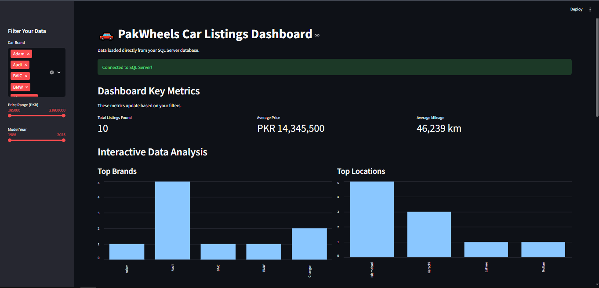
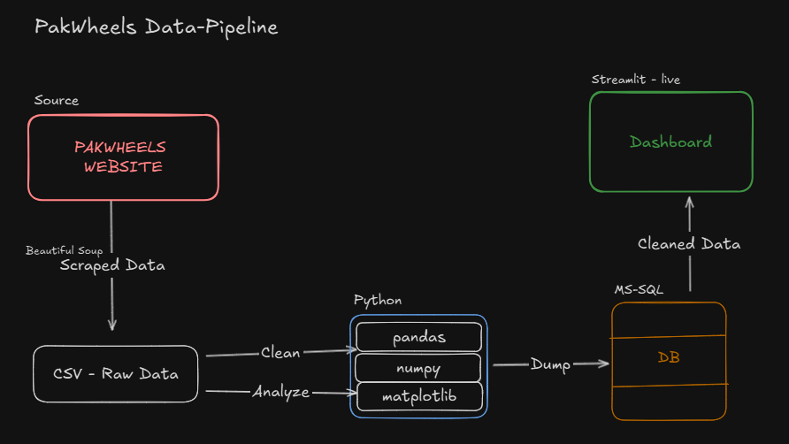

# 🚗 PakWheels Used Car Data Pipeline

[](YOUR_STREAMLIT_APP_URL_HERE)

An end-to-end data engineering project that automatically scrapes, cleans, and analyzes used car listings from PakWheels.com. The final, clean data is loaded into a SQL Server database and visualized in a live, interactive Streamlit dashboard.

---

## 📸 Final Dashboard

Here is a screenshot of the final, interactive dashboard built with Streamlit.



---

## 🛠️ Tech Stack

This project was built using a modern Python data stack:

- **Data Extraction:** `Requests` & `BeautifulSoup4`
- **Data Cleaning:** `Pandas` & `NumPy`
- **Data Loading:** `SQLAlchemy`, `pyodbc`, & `Microsoft SQL Server`
- **Dashboard:** `Streamlit`
- **Utilities:** `toml` (for secret management)

---

## 🏛️ Project Architecture

The project follows a 4-stage ETL & Visualization pipeline:

1.  **Extract:** A Python script scrapes 10+ pages of car listings from PakWheels.com and saves the raw, unstructured data to a CSV file.
2.  **Transform:** A cleaning script loads the raw CSV into Pandas, cleans the data (e.g., "PKR 63.5 lacs" -> `6350000`), and performs 5+ analyses.
3.  **Load:** The clean, transformed DataFrame is loaded into a `car_listings` table in a Microsoft SQL Server database.
4.  **Visualize:** The Streamlit dashboard connects directly to the SQL database, pulling the data live and displaying it with interactive filters.



---

## 🚀 How to Run This Project Locally

Follow these steps to set up and run the project on your local machine.

### 1. Prerequisites

- Python 3.10+
- Microsoft SQL Server (with an "ODBC Driver 17" or similar)
- A SQL database (e.g., `PakWheelsReport`) with a user (e.g., `sa`) that has write permissions.

### 2. Clone the Repository

```bash
git clone [https://github.com/YOUR_USERNAME/PakWheels-Data-Pipeline.git](https://github.com/YOUR_USERNAME/PakWheels-Data-Pipeline.git)
cd PakWheels-Data-Pipeline
```
